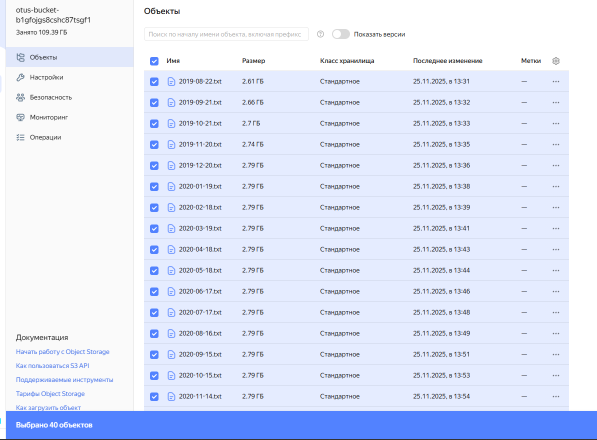
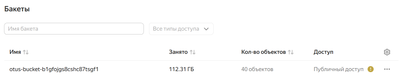
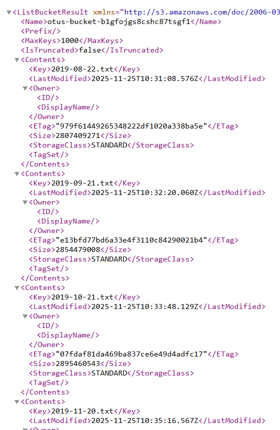

# Домашнее задание: Spark-кластер в Yandex Cloud

---

## Структура проекта

```
infra/
├── main.tf
├── variables.tf
├── provider.tf
├── terraform.tfvars.example
├── scripts/
│   ├── user_data.sh
│   └── upload_data_to_hdfs.sh
```

---

## Запуск

### 1. Подготовка

1. Установите [Terraform](https://developer.hashicorp.com/terraform/downloads)

2. Получите:
    - **OAuth-токен**: [https://oauth.yandex.ru/authorize?response_type=token&client_id=1a699ffb0...](https://oauth.yandex.ru/authorize?response_type=token&client_id=1a699ffb0d8d4d3a92f0c0b5e5a1b3d7)
    - **Cloud ID** и **Folder ID**: в [консоли Yandex Cloud](https://console.cloud.yandex.ru/)

3. Создайте SSH-ключ (если нет):
    ```bash
    ssh-keygen -t rsa -b 2048 -f ~/.ssh/otus-yc
    ```

### 2. Настройка Terraform

1. Перейдите в папку с инфраструктурой:
    ```bash
    cd infra
    ```
2. Создайте файл `terraform.tfvars` на основе шаблона:
    ```bash
    cp terraform.tfvars.example terraform.tfvars
    ```
3. Заполните его своими данными:
    ```
    yc_token                 = "y0__..."  # ваш OAuth-токен
    yc_cloud_id              = "b1g..."   # Cloud ID
    yc_folder_id             = "b1g..."   # Folder ID
    ...
    ```

### 3. Запуск инфраструктуры

```bash
terraform init
terraform apply
```

Дождитесь завершения. Terraform создаст:
- bucket с данными
- сеть и правила доступа
- кластер
- вспомогательную proxy машину

### 4. Копирование данных в HDFS

1. Подключитесь к proxy-машине (IP выводится в `terraform apply`):
    ```bash
    ssh -i ~/.ssh/otus-yc ubuntu@<PROXY_PUBLIC_IP>
    ```
2. Находясь на proxy-машине cкопируйте скрипт на мастер-ноду кластера:
    ```bash
    scp -i ~/.ssh/otus-yc /home/ubuntu/scripts/upload_data_to_hdfs.sh ubuntu@<MASTER_IP>:/home/ubuntu/
    ```
3. Подключитесь к мастер-ноде и запустите скрипт:
    ```bash
    ssh -i ~/.ssh/otus-yc ubuntu@<MASTER_IP>

    # BUCKET_NAME выводится в terraform apply
    S3_BUCKET=<BUCKET_NAME> ./upload_data_to_hdfs.sh
    ```

### 5. Остановка (очиска) кластера

```bash
terraform destroy
```

---

## Оценка затрат

| Ресурс | Месячная стоимость, ₽ |
|-|-|
| Spark-кластер (4 ноды) | 32 046,54 |
| Object Storage (500 ГБ, стандартное) | 1 083,22 |

Согласно расчёту по тарифному калькулятору Yandex Cloud:

- Spark-кластер (1 мастер-нода + 3 дата-ноды, работа 24/7) стоит 32 046,54 ₽ в месяц.
  Эта стоимость включает аренду вычислительных ресурсов и дискового пространства в составе кластера (HDFS).

- Хранение тех же данных (500 ГБ) в Object Storage обходится всего в 1 083,22 ₽ в месяц.

HDFS-хранилище дороже объектного в ~30 раз

---

## Скриншоты

### Содержимое bucket на платформе YandexCloud



### bucket на платформе YandexCloud



### Содержимое bucket в браузере

XML после перехода по [ссылке на bucket](https://otus-bucket-b1gfojgs8cshc87tsgf1.storage.yandexcloud.net/)



### Скриншот после выполнения `hdfs dfs -ls`:


