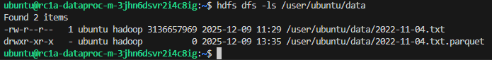

# Домашнее задание: Анализ качества и очистка датасета мошеннических финансовых операций

---

## Запуск

### 1. Подготовка

1. Установите [Terraform](https://developer.hashicorp.com/terraform/downloads)

2. Получите:
    - **OAuth-токен**: [https://oauth.yandex.ru/authorize?response_type=token&client_id=1a699ffb0...](https://oauth.yandex.ru/authorize?response_type=token&client_id=1a699ffb0d8d4d3a92f0c0b5e5a1b3d7)
    - **Cloud ID** и **Folder ID**: в [консоли Yandex Cloud](https://console.cloud.yandex.ru/)

3. Создайте SSH-ключ (если нет):
    ```bash
    ssh-keygen -t rsa -b 2048 -f ~/.ssh/otus-yc
    ```

### 2. Настройка Terraform

1. Перейдите в папку с инфраструктурой:
    ```bash
    cd infra
    ```
2. Создайте файл `terraform.tfvars` на основе шаблона:
    ```bash
    cp terraform.tfvars.example terraform.tfvars
    ```
3. Заполните его своими данными:
    ```
    yc_token                 = "y0__..."  # ваш OAuth-токен
    yc_cloud_id              = "b1g..."   # Cloud ID
    yc_folder_id             = "b1g..."   # Folder ID
    ...
    ```

В параметре `s3_copy_limit` можно указать необходимое количество файлов для копирования:
- `""` (пустая строка): копировать все файлы
- `"N"` (целое число): копировать N первых файлов
- `"latest"`: копировать последний (по дате) файл


### 3. Запуск инфраструктуры

```bash
terraform init
terraform apply
```

Дождитесь завершения. Terraform создаст:
- bucket с данными
- сеть и правила доступа
- кластер
- вспомогательную proxy машину

### 4. Копирование данных в HDFS

1. Подключитесь к proxy-машине (<PROXY_PUBLIC_IP> выводится в `terraform apply`):
    ```bash
    ssh -i ~/.ssh/otus-yc ubuntu@<PROXY_PUBLIC_IP>
    ```
2. Находясь на proxy-машине cкопируйте скрипты на мастер-ноду кластера (<MASTER_IP> доступно по команде `yc compute instance list`):
    ```bash
    scp -i ~/.ssh/otus-yc /home/ubuntu/scripts/upload_data_to_hdfs.sh ubuntu@<MASTER_IP>:/home/ubuntu/

    scp -i ~/.ssh/otus-yc /home/ubuntu/scripts/setup_jupyter.sh ubuntu@<MASTER_IP>:/home/ubuntu/
    ```
3. Подключитесь к мастер-ноде и запустите скрипты:
    ```bash
    ssh -i ~/.ssh/otus-yc ubuntu@<MASTER_IP>

    # BUCKET_NAME выводится в terraform apply
    S3_BUCKET=<BUCKET_NAME> ./upload_data_to_hdfs.sh

    ./setup_jupyter.sh
    ```

### 5. Организация доступа к Jupytrer секверу Мастер-ноды (SSH-туннель ПК → Прокси → Мастер)

```bash
# Туннель ПК → Прокси
ssh -i ~/.ssh/otus-yc -L 8888:localhost:8888 ubuntu@<PROXY_PUBLIC_IP>

# Туннель Прокси → Мастер
ssh -i ~/.ssh/otus-yc -L 8888:localhost:8888 ubuntu@<MASTER_IP>

# Запуск Jupyter на Мастер-ноде
jupyter notebook --ip=0.0.0.0 --port=8888 --no-browser --allow-root --NotebookApp.token='' --NotebookApp.password='' --NotebookApp.disable_check_xsrf=True
```

Для проверки работоспособности можно перейти по адресу http://localhost:8888

---

### 6. Остановка (очиска) кластера

```bash
terraform destroy
```

---

## Скриншот

### Наличие очищенного `.parquet` файла


