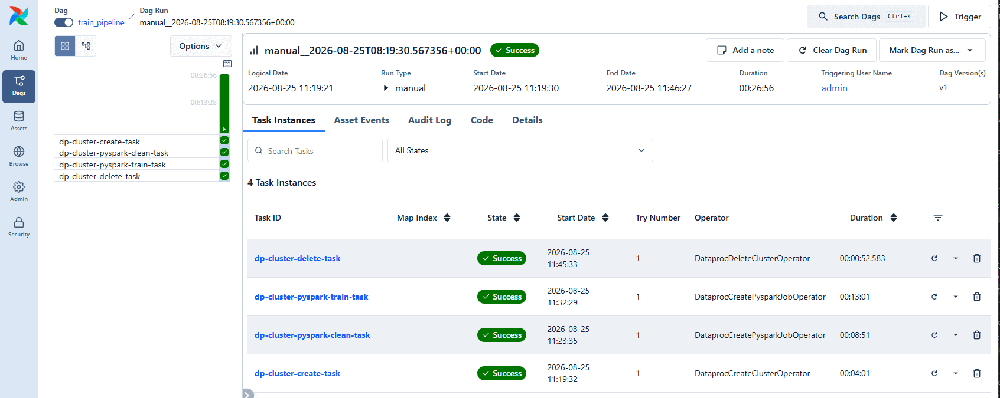
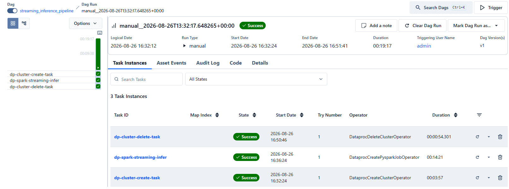
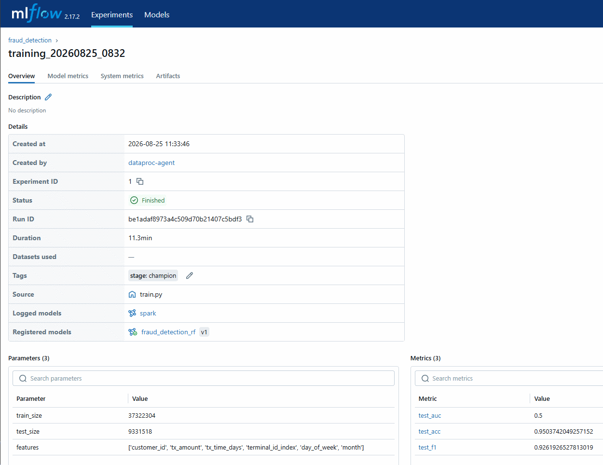
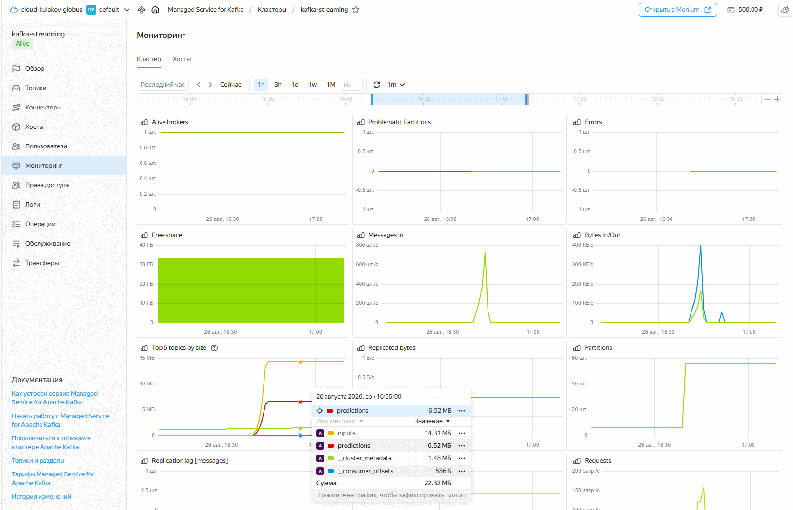
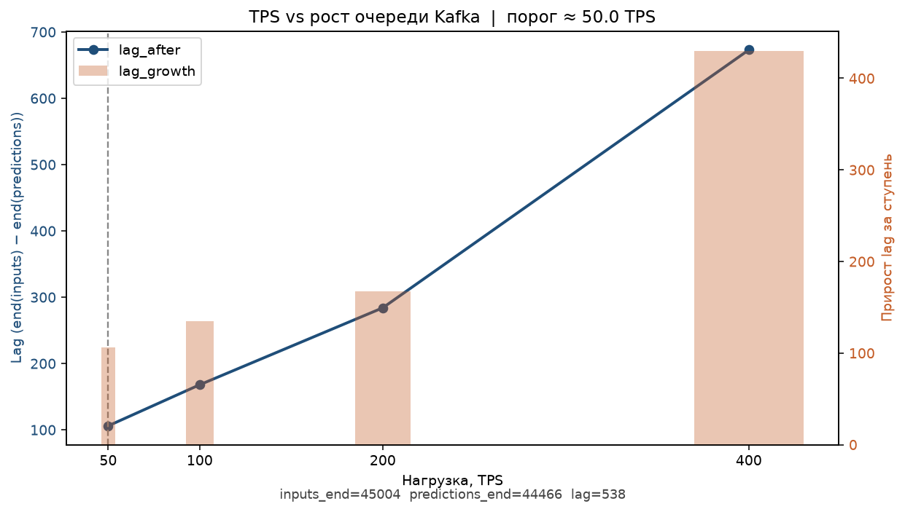

# Домашнее задание: Инференс на потоке (Apache Kafka + Spark Streaming)

---

## Запуск

### 1. Подготовка

1. Установите [Terraform](https://developer.hashicorp.com/terraform/downloads)

2. Получите:
    - **OAuth-токен**: [тут](https://oauth.yandex.ru/)
    - **Cloud ID** и **Folder ID**: в [консоли Yandex Cloud](https://console.cloud.yandex.ru/)

### 2. Настройка Terraform

1. Перейдите в папку с инфраструктурой:
    ```bash
    cd infra
    ```
2. Создайте файл `terraform.tfvars` на основе шаблона:
    ```bash
    cp terraform.tfvars.example terraform.tfvars
    ```
3. Заполните его своими данными:
    ```
    yc_config = {
      token     = "y0__..."  # ваш OAuth-токен
      cloud_id  = "b1g..."   # Cloud ID
      folder_id = "b1g..."   # Folder ID
      zone      = "ru-central1-a"
    }
    ...
    ```

### 3. Запуск инфраструктуры

```bash
terraform init
terraform apply
```

Дождитесь завершения. Terraform создаст:
- bucket с данными
- сеть и правила доступа
- кластер AirFlow
- сервер MlFlow
- кластер Apache Kafka

---

### 4. Запуск скриптов копирования

1. Перейдите в корневой каталог

```bash
cd ..
```

2. Установите пакетный менеджер `uv`, если ещё не установлен

```bash
pip install uv
```

3. Установите виртуальное окружение
```bash
uv sync

# Активация виртуального окружения
source .venv/bin/activate  # Linux/Mac
# или
.venv\Scripts\activate     # Windows
```

4. Запустите скрипт

```bash
cd scripts
```

**Основной синтаксис**:
```bash
python main.py [copy_limit] [--only {vars,dags,src,data,venv}]
```
**Параметры**:

- `copy_limit` (опциональный):
  - `latest` - только последние данные (по умолчанию)
  - `all` - все данные
  - число - ограничение количества записей

- `--only` (опциональный):
  - `vars` - только переменные Airflow
  - `dags` - только DAG-файлы
  - `src` - только исходный код
  - `data` - только данные
  - `venv` - только архив с виртуальным окружением

**Примеры использования**:

- Копировать только последние данные:

```bash
python main.py
```

- Копировать все данные:

```bash
python main.py all
```

- Копировать только DAGs:

```bash
python main.py --only dags
```

5. Создайте connection в Airflow UI:
    - Admin -> Connections -> **+**
    - Connection Id: `yc-sa`
    - Connection Type: `Yandex Cloud`
    - в поле **Public SSH key** вставьте значение `DP_SA_AUTH_KEY_PUBLIC_KEY` из `infra/variables.json`

---

### 5. Остановка (очиска) кластера

С целью предотвращения ошибок желательно предварительно очистить созданный бакет от данных вручную либо с помощью команды

```bash
aws s3 rm s3://<BUCKET_NAME> --recursive --endpoint-url https://storage.yandexcloud.net
```

Далее удалить созданную инфраструктуру

```bash
terraform destroy
```

---

## Скриншоты

### Airflow: train_pipeline



### Airflow: streaming_inference_pipeline



### MLflow Model Registry (champion)



### Kafka: топики inputs / predictions



### Нагрузка: TPS vs рост очереди

График роста очереди сообщений при генерации 50/100/200/400 сообщений в секунду при длительности нагрузки 60 секунд (на каждую ступень)


