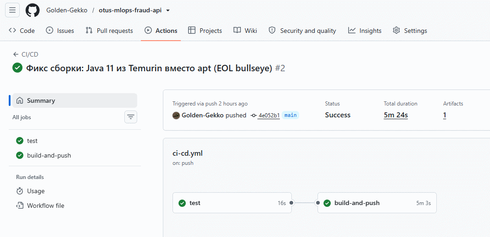
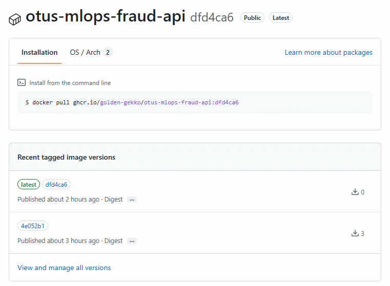
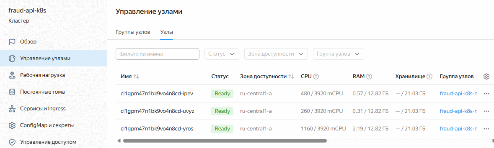
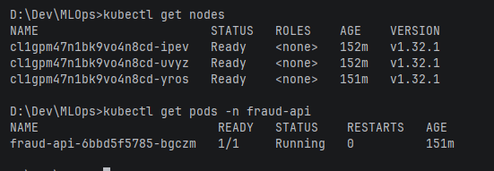
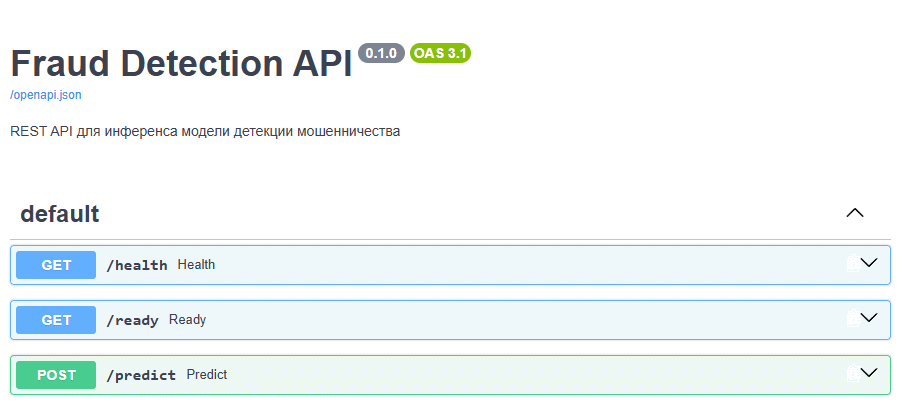

# Домашнее задание: Обновление модели (REST API + Kubernetes)

---

## Запуск

### 1. Подготовка

1. Установите [Terraform](https://developer.hashicorp.com/terraform/downloads), [kubectl](https://kubernetes.io/docs/tasks/tools/) и [yc CLI](https://yandex.cloud/ru/docs/cli/quickstart#install)

2. Получите:
    - **OAuth-токен**: [тут](https://oauth.yandex.ru/)
    - **Cloud ID** и **Folder ID**: в [консоли Yandex Cloud](https://console.cloud.yandex.ru/)

3. Создайте репозиторий на GitHub (например `fraud-api`) и запушьте код

### 2. Настройка Terraform

1. Перейдите в папку с инфраструктурой:
    ```bash
    cd infra
    ```
2. Создайте файл `terraform.tfvars` на основе шаблона:
    ```bash
    cp terraform.tfvars.example terraform.tfvars
    ```
3. Заполните его своими данными:
    ```
    yc_config = {
      token     = "y0__..."  # ваш OAuth-токен
      cloud_id  = "b1g..."   # Cloud ID
      folder_id = "b1g..."   # Folder ID
      zone      = "ru-central1-a"
    }
    ```

### 3. Сборка и публикация образа (CI/CD GitHub Actions)

Пуш или PR в ветку `main` автоматически запускает пайплайн (`.github/workflows/ci-cd.yml`):

1. **test** — юнит-тесты (без внешних зависимостей)
2. **build-and-push** — при успехе тестов сборка Docker-образа и публикация в `ghcr.io`:
    - при сборке внутри образа обучается stub-модель и запекается локальный MLflow-реестр
    - публикация: `ghcr.io/<USER>/<REPO>:latest` (используется встроенный `GITHUB_TOKEN`)

### 4. Запуск инфраструктуры

```bash
terraform init
terraform apply
```

Дождитесь завершения. Terraform создаст в Yandex Cloud:
- сеть, подсеть и security groups
- сервисный аккаунт с ролями
- Managed Kubernetes кластер из 3 узлов (`fraud-api-k8s`)

### 5. Деплой сервиса

1. Подключите kubectl к кластеру:
    ```bash
    yc managed-kubernetes cluster get-credentials fraud-api-k8s --external
    kubectl get nodes
    ```
2. Задеплойте манифесты:
    ```bash
    kubectl apply -f k8s/
    kubectl get pods -n fraud-api   # дождаться статуса 1/1 Ready
    ```
3. Получите URL сервиса (NodePort на публичных IP узлов):
    ```bash
    kubectl get nodes -o wide   # колонка EXTERNAL-IP
    ```
    Сервис опубликован на порт `30080`: `http://<NODE_EXTERNAL_IP>:30080`

### 6. Тестирование через публичный API

```bash
curl http://<NODE_EXTERNAL_IP>:30080/health
curl http://<NODE_EXTERNAL_IP>:30080/ready
curl -X POST http://<NODE_EXTERNAL_IP>:30080/predict \
  -H "Content-Type: application/json" \
  -d '{"transactions":[{"transaction_id":1,"tx_datetime":"2024-01-15 10:30:00","customer_id":123,"terminal_id":456,"tx_amount":9000.0,"tx_time_seconds":1000,"tx_time_days":1}]}'
```

Ожидаемый ответ на транзакцию с суммой > 1500 (правило stub-модели):
```json
{
  "predictions": [
    {
      "transaction_id": 1,
      "prediction": 1,
      "probability": 0.707191
    }
  ]
}
```
### 7. Остановка (очистка)

```bash
cd infra
terraform destroy
```

---

## Скриншоты

### GitHub Actions: успешный CI/CD прогон (test + build-and-push)



### GitHub Container Registry: опубликованный образ



### Yandex Cloud: k8s кластер из 3 узлов



### Kubernetes: узлы и под сервиса (Ready)



### Тестирование публичного API: /docs


