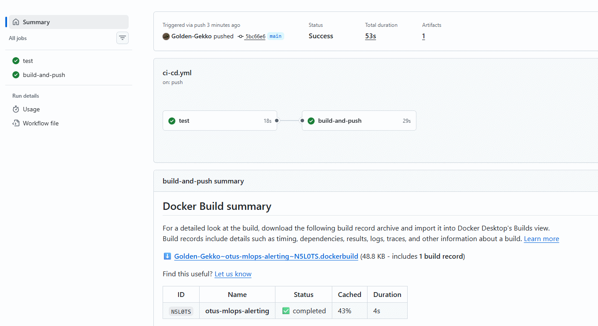
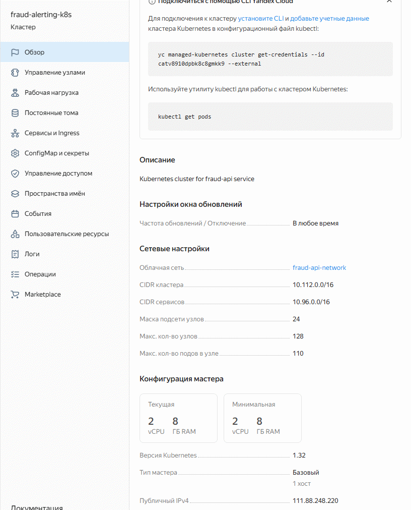
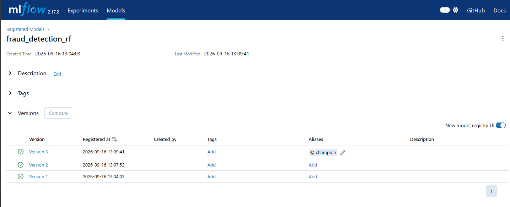
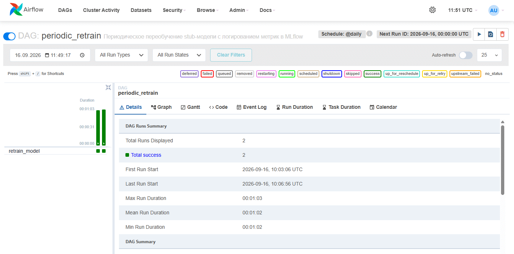
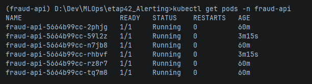
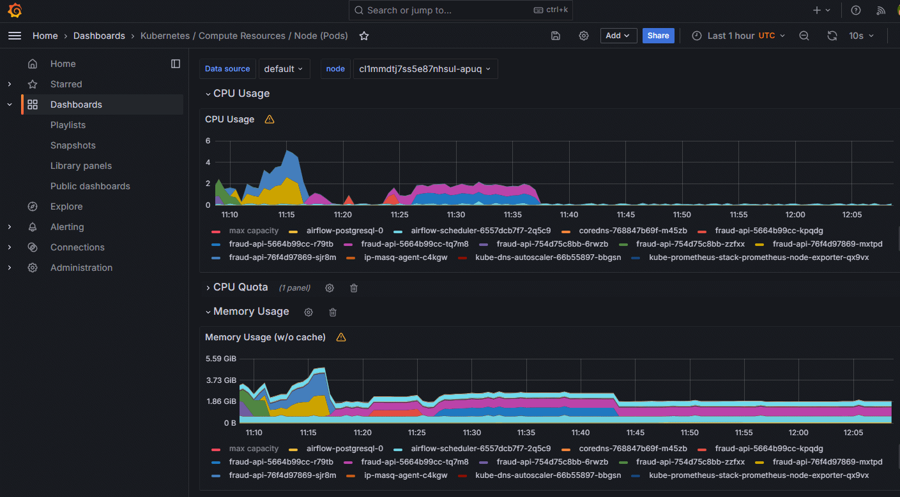
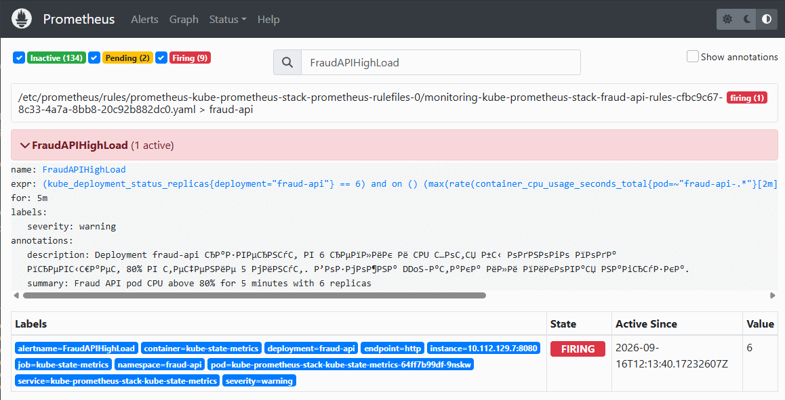

# Домашнее задание: Развёртывание модели с мониторингом и алертингом

---

## Запуск

### 1. Подготовка

1. Установите [Terraform](https://developer.hashicorp.com/terraform/downloads), [kubectl](https://kubernetes.io/docs/tasks/tools/), [yc CLI](https://yandex.cloud/ru/docs/cli/quickstart#install), [Helm](https://helm.sh/docs/intro/install/), `jq` и `envsubst`

2. Получите:
    - **OAuth-токен**: [тут](https://oauth.yandex.ru/)
    - **Cloud ID** и **Folder ID**: в [консоли Yandex Cloud](https://console.cloud.yandex.ru/)
    - **SSH-ключ** (для доступа к MLflow-VM)

3. Создайте репозиторий на GitHub (например `fraud-api`) и запушьте код

### 2. Настройка Terraform

1. Перейдите в папку с инфраструктурой:
    ```bash
    cd infra
    ```
2. Создайте файл `terraform.tfvars` на основе шаблона:
    ```bash
    cp terraform.tfvars.example terraform.tfvars
    ```
3. Заполните его своими данными:
    ```
    yc_config = {
      token     = "y0__..."  # ваш OAuth-токен
      cloud_id  = "b1g..."   # Cloud ID
      folder_id = "b1g..."   # Folder ID
      zone      = "ru-central1-a"
    }

    public_key_path  = "~/.ssh/id_rsa.pub"
    private_key_path = "~/.ssh/id_rsa"

    kafka_producer_password = "ProducerPass123!"
    kafka_consumer_password = "ConsumerPass123!"
    ```

### 3. Сборка и публикация образа (CI/CD GitHub Actions)

Пуш или PR в ветку `main` автоматически запускает пайплайн (`.github/workflows/ci-cd.yml`):

1. **test** — юнит-тесты (без внешних зависимостей)
2. **build-and-push** — при успехе тестов сборка Docker-образа и публикация в `ghcr.io`:
    - при сборке внутри образа обучается stub-модель и запекается локальный MLflow-реестр
    - публикация: `ghcr.io/<USER>/<REPO>:latest` (используется встроенный `GITHUB_TOKEN`)

### 4. Запуск инфраструктуры

```bash
terraform init
terraform apply
```

Дождитесь завершения. Terraform создаст в Yandex Cloud:
- сеть, подсеть и security groups
- сервисный аккаунт с ролями
- Managed Kubernetes кластер из 3 узлов (`fraud-api-k8s`)
- Managed Kafka (`fraud-api-kafka`) с топиками `inputs`/`predictions`
- MLflow-VM (Compute Instance) с S3-артефактами
- S3 bucket для артефактов

После применения Terraform сгенерирует `infra/variables.json` с переменными окружения
(MLflow URI, Kafka bootstrap, S3-ключи, имя кластера).

### 5. Деплой сервиса

1. Подключите kubectl к кластеру:
    ```bash
    yc managed-kubernetes cluster get-credentials fraud-api-k8s --external --force
    kubectl get nodes
    ```

    > Если публичный endpoint мастера не отвечает на TLS, пробросьте SSH-туннель
    > через MLflow-VM и переключите kubeconfig:
    > ```bash
    > ssh -i ~/.ssh/id_rsa -N -L 6443:10.200.0.7:443 ubuntu@<MLFLOW_EXTERNAL_IP> &
    > kubectl config set-cluster <CLUSTER_NAME> --server=https://127.0.0.1:6443
    > ```

2. Задеплойте приложение, мониторинг (Prometheus/Grafana/Alertmanager) и Airflow одним скриптом:
    ```bash
    bash scripts/deploy_app.sh
    ```

3. Проверьте, что поды приложения поднялись и HPA работает:
    ```bash
    kubectl get pods -n fraud-api
    kubectl get hpa -n fraud-api   # min 4, max 6 реплик по CPU 80%
    ```

### 6. Переобучение модели

```bash
kubectl exec -n airflow deploy/airflow-scheduler -- airflow dags unpause periodic_retrain
kubectl exec -n airflow deploy/airflow-scheduler -- airflow dags trigger periodic_retrain
```

DAG `periodic_retrain` подгружается автоматически из внешнего git-репозитория через GitSync,
обучает stub-модель и логирует метрику `test_auc` в MLflow.

### 7. Тестирование через публичный API

Получите публичный IP узла:
```bash
kubectl get nodes -o wide   # колонка EXTERNAL-IP
```

Сервис опубликован на порт `30080` (`http://<NODE_EXTERNAL_IP>:30080`):

```bash
curl http://<NODE_EXTERNAL_IP>:30080/health
curl http://<NODE_EXTERNAL_IP>:30080/metrics
curl -X POST http://<NODE_EXTERNAL_IP>:30080/predict \
  -H "Content-Type: application/json" \
  -d '{"transactions":[{"transaction_id":1,"tx_datetime":"2024-01-15 10:30:00","customer_id":123,"terminal_id":456,"tx_amount":9000.0,"tx_time_seconds":1000,"tx_time_days":1}]}'
```

Ожидаемый ответ `health`:
```json
{"status":"healthy","model_loaded":true,"model_name":"fraud_detection_rf","model_alias":"champion"}
```

### 8. Имитация атаки и срабатывание алерта

1. Экспортируйте переменные Kafka из `infra/variables.json`:
    ```bash
    export KAFKA_BOOTSTRAP_SERVERS=<bootstrap>
    export KAFKA_INPUT_TOPIC=inputs
    export KAFKA_PRODUCER_USER=producer
    export KAFKA_PRODUCER_PASSWORD=<password>
    export KAFKA_CONSUMER_USER=consumer
    export KAFKA_CONSUMER_PASSWORD=<password>
    export KAFKA_SECURITY_PROTOCOL=SASL_SSL
    export KAFKA_SASL_MECHANISM=SCRAM-SHA-512
    export API_URL=http://<NODE_EXTERNAL_IP>:30080/predict
    ```

2. Запустите наращивание потока событий:
    ```bash
    uv run python scripts/load_test.py \
      --start-rate 100 \
      --ramp-step 20 \
      --ramp-interval 30 \
      --max-rate 600 \
      --workers 32 \
      --duration 780
    ```

При росте нагрузки:
- HPA масштабирует `fraud-api` с 4 до 6 реплик;
- CPU подов превышает 80%;
- через 5 минут срабатывает алерт `FraudAPIHighLoad`

### 9. Остановка (очистка)

```bash
cd infra
terraform destroy
```

---

## Скриншоты

### GitHub Actions: успешный CI/CD прогон



### Yandex Cloud: k8s кластер из 3 узлов



### MLflow: зарегистрированная модель



### Airflow: успешный прогон DAG



### Kubernetes: увеличение до 6 реплик



### Grafana



### Prometheus: алерт


